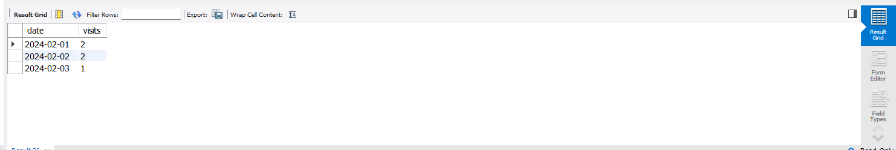
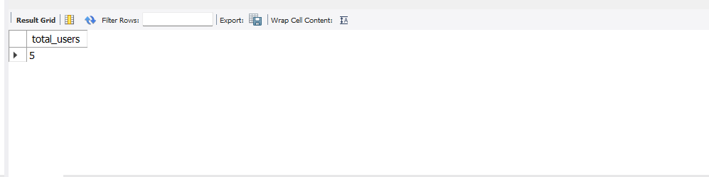
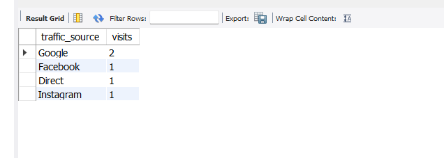

Website Analytics & Conversion Analysis (SQL Project)

 Project Overview:
* This project analyzes website user behavior, traffic sources, and conversion performance using SQL.
* The goal is to extract meaningful insights such as user activity, bounce rate, and revenue generation.

Objectives:
* Analyze website traffic trends
* Identify top-performing pages
* Measure user engagement
* Calculate conversion rate and revenue
* Understand traffic source performance

Database Design:

The project uses 4 main tables:

* Users – stores user information
* Sessions – tracks user visits
* Pageviews – records pages visited
* Conversions – stores purchase/revenue data

  
Tools Used:
* MySQL
* SQL (Joins, Aggregations, Subqueries)

  
Key Analysis Performed:
* Total Users Count
* Daily Website Traffic
* Traffic Source Analysis
* Most Visited Pages
* Average Session Duration
* Bounce Rate Calculation
* Conversion Rate Analysis
* Revenue Analysis

  
Advanced Analysis:
* Funnel Analysis (Product → Checkout → Purchase)
* User Retention Analysis

Results & Insights:
* Identified highest traffic sources
* Found most popular pages
* Calculated conversion rate and revenue trends
* Analyzed user engagement patterns

  
Project Structure:
website-analytics-sql-project/

--> dataset/
--> queries/
--> screenshots/
--> README.md

How to Run:
* Open MySQL Workbench
* Run the SQL script
* Execute analysis queries
* View results

* 
  output:

